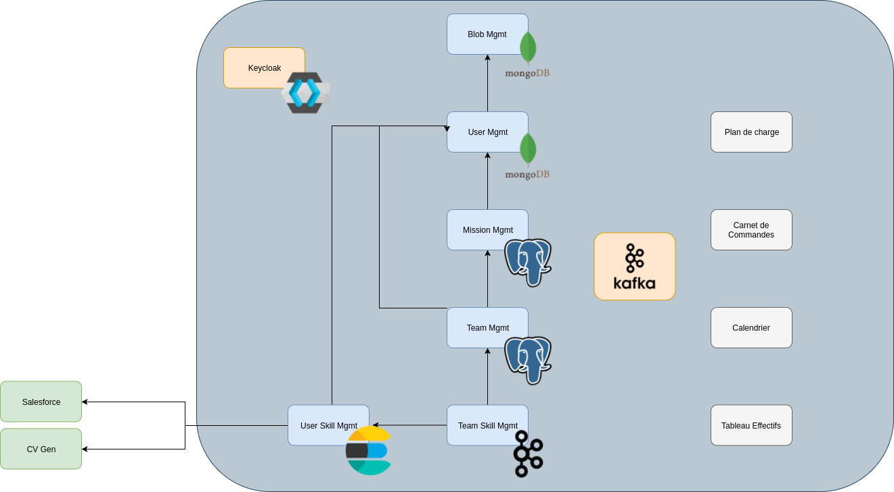

= Dossier d'Architecture Technique

:toc:

Ce document décrit l'architecture technique du système OPUS.

Le système OPUS implémente différents services de gestion des utilisateurs, des équipes, des compétences, des plans de charges, ...

== ARCHITECTURE LOGIQUE

=== Description

L'architecture du système est construit comme un ensemble d'applications autonomes.

La conception du système est basée sur le pattern https://martinfowler.com/articles/201701-event-driven.html[Event-Carried State Transfer]. C'est le mode de communication principal entre les applications.

* Les événements métier sont publiés sur le bus de message. Ceci permet par exemple a une application de s'abonner aux événements de création d'utilisateur pour conserver sa base de données d'utilisateurs à jour.

De cette manière, chaque application dispose d'une base de données locale qui lui permet de stocker ses données propres ainsi qu'une vue des données (des autres applications) nécessaires à son fonctionnement. Chaque application gère par exemple sa propre liste d'utilisateurs en ne filtrant que les informations utiles.

Ces mécanismes de communication asynchrones simplifient l'intégration de nouvelles applications.

L'architecture implémente aussi des patterns https://martinfowler.com/articles/enterpriseREST.html[REST].

* Si un service A d'une application a besoin d'une donnée gérée par un service B d'une autre application (pour réaliser un traitement), le service A appelle le service B en mode synchrone.

=== Composants

.Composants
|===
|Composant| Fonction

|Keycloak
|Serveur d'Authentification

|Kafka
|Bus de messages

|Blob Management
|Gestion du stockage de Fichiers

|User Management
|Gestion des données Utilisateur

|Mission Management
|Gestion des données Mission

|Team Management
|Gestion des données Equipe

|User Skill Management
|Gestion des compétences des Utilisateurs

|Team Skill Management
|Gestion des compétences des Equipes

|Plan de charge
|Plan de charge

|Carnet de commandes
|Carnet de commandes

|Calendrier
|Calendrier des Utilisateurs et Gestion d'Alertes

|Tableau des effectifs
|Gestion des effectifs

|Salesforce
|Salesforce

|CV Gen
|Application SOFTEAM de Gestion de CV

|===

== ARCHITECTURE PHYSIQUE

L'architecture physique est basée sur deux points :

* Le déploiement d'applications conteneurisées sur un cluster Kubernetes
* La persistance de volumes des conteneurs sur des disques NFS

=== Cluster Kubernetes

Le cluster Kubernetes est un orchestrateur Docker : il permet d'automatiser le déploiement, la mise à l'échelle (scaling), la gestion d'applications conteneurisées.

K8s ne gère pas la persistance des données des applications. K8s permet néanmoins aux conteneurs d'utiliser des moyens de persistance externes (exemple: partition NFS).

Le cluster est composé de plusieurs nœuds : chaque nœud est une VM. K8s gère deux types de nœuds : des nœuds maître (master) et des nœuds esclave (slave).

=== Partitions NFS

Les partitions NFS sont fournies par OVH. 

* OVH gère la haute disponibilité et le backup des partitions

=== Dimensionnement

Pour dimensionner l'architecture physique, nous nous basons sur l'hypothèse que les besoins principaux des applications sont des besoins de RAM. En effet, les applications déployées sont des applications java (besoin de RAM important) peu sollicitées (aucun processus métier qui nécessite du CPU).

Ensuite, nous estimons les besoins globaux (cf. <<dimensionnement_apps>>) en RAM des applications.

En partant de cette estimation globale, nous calculons en fonction de la puissance de VMs le nombre de VMs nécessaires (cf. <<dimensionnement_serveurs>>).

* Pour calculer la RAM utile d'un serveur il faut prendre en compte l'exécution, sur chaque nœud :
  * d'un agent https://kubernetes.io/docs/reference/command-line-tools-reference/kubelet/[kubelet]
  * d'un agent https://www.elastic.co/fr/products/beats/filebeat[FileBeat] pour la centralisation des logs

#VM = #RAM Total / (#RAM VM - #RAM Kubelet - # RAM FileBeat)

[[dimensionnement_apps]]
.Dimensionnement des Applications
|===
|   |  |  |  | RAM / Instance | Disk / Instance | Instance | Total RAM | Total Disk | CPU |
|  :------ | :------ | :------ | ------ | :------ | :------ | :------ | :------ | :------ | :------ |
|  Tools Software Factory |  |  |  |  |  |  |  |  |  |
|   | Jenkins | Java |  | 4 | 20 | 1 | 4 | 20 | 1 |
|   | Nexus | Java |  | 4 | 30 | 1 | 4 | 30 | 1 |
|   | SonarQube | Java |  | 4 | 30 | 1 | 4 | 30 | 1 |
|   | Keycloak | Java |  | 1 | 2 | 1 | 1 | 2 | 1 |
|  Monitoring |  |  |  |  |  |  |  |  |  |
|   | Kibana | Node |  | 1 | 1 | 1 | 1 | 1 | 1 |
|   | ElasticSearch | Java |  | 2 | 5 | 2 | 4 | 10 | 1 |
|   | Grafana | Java |  | 1 | 2 | 1 | 1 | 2 | 1 |
|  Apps |  |  |  |  |  |  |  |  |  |
|   | Blob Mgmt | C# |  | 1 | 1 | 2 | 2 | 2 | 1 |
|   | Blob Mgmt Database | MongoDB |  | 0.5 | 1 | 2 | 1 | 2 | 1 |
|   | User Mgmt | C# |  | 1 | 1 | 2 | 2 | 2 | 1 |
|   | User Mgmt Database | MongoDB |  | 0.5 | 1 | 2 | 1 | 2 | 1 |
|   | Mission Mgmt | Kotlin |  | 1 | 1 | 2 | 2 | 2 | 1 |
|   | Mission Mgmt Database | PostgreSQL |  | 0.5 | 1 | 2 | 1 | 2 | 1 |
|   | Team Mgmt | Node |  | 1 | 1 | 2 | 2 | 2 | 1 |
|   | Team Mgmt Database | PostgreSQL |  | 0.5 | 1 | 2 | 1 | 2 | 1 |
|   | Team Skill Mgmt | Kotlin |  | 1 | 1 | 2 | 2 | 2 | 1 |
|   | Team Skill Mgmt Database | Kafka |  | 2 | 20 | 4 | 8 | 80 | 1 |
|   | User Skill Mgmt | Java |  | 1 | 1 | 2 | 2 | 2 | 1 |
|   | User Skill Mgmt Database | ElasticSearch |  |  |  |  |  |  | 1 |
|   | Total |  |  |  |  | 32 | 43 | 195 | 19 |
|===

.Dimensionnement non utile des nœuds du cluster
|===
|Service| RAM

|Kubernetes Node
|1 Go

|FileBeat
|0,5 Go
|===

[[dimensionnement_serveurs]]
.Dimensionnement des Serveurs
|===
|RAM / Instance| #Instance

|8 Go
|6,615384615

|64 Go
|0,688
|===

=== Pricing

.Pricing

|===
|  **Name** | **unit RAM** | **unit vCPU** | **unit Price** | **nb Instance** | **total RAM** | **total vCPU** | **total Price** |
|  :------: | :------: | :------: | :------: | :------: | :------: | :------: | :------: |
|  VPS SSD 3 | 8 | 2 | 11.99 | 7 | 56 | 14 | 83.93 |
|  SP-32 | 32 | 8 | 69.99 | 2 | 64 | 16 | 139.98 |
|  SP-64 | 64 | 8 | 99.99 | 1 | 64 | 8 | 99.99 |
|===

== SÉCURITÉ

=== Connexion SSH

La connexion SSH aux VMs du cluster est réalisé par enregistrement de clefs SSH.

=== Authentification applicatif

La gestion de l'authentification/autorisation est géré par mise en place du protocole https://openid.net/connect/[OpenID Connect].

Le Flow a utiliser est "Authorization Code Flow" : ce processus permet à un utilisateur de s'authentifier via un navigateur Web, à une application Web qui a un BackEnd capable de gérer des secrets (c'est le cas de nos applications).

Quand un service appelle un autre service, il passe le token d'authentification dans les entêtes de la requête.

== RÉSILIENCE

=== Tolérance aux Pannes

Nous gérons deux types de pannes : les pannes des applications et les pannes du cluster.

==== Pannes des applications

La gestion des pannes des applications est gérée par Kubernetes.

Pour y arriver, Kubernetes se base sur https://kubernetes.io/docs/tasks/configure-pod-container/configure-liveness-readiness-probes/[les lignes de vie des applications].

Si la ligne de vie d'une application ne répond pas, Kubernetes se charge de redémarrer l'application. Chaque application déployée doit donc définir ses lignes de vie.

....
@TAG SCN_APP_HEALTHCHECK
Scenario: Application HealthCheck
Given I am a developer of an application
When the applications probes do not respond
Then the Kubernetes restarts the application
....

==== Pannes du Cluster

La gestion des pannes du cluster est gérée de deux manières.

La première solution consiste à faire un backup des données du cluster. En cas de panne du master, nous pouvons recréer un master identique au master en panne (en repartant des données du backup).

* L'état du cluster est géré via une base de données clef-valeur https://coreos.com/etcd/[etcd].

La seconde solution plus complexe consiste à réaliser une installation multi-maîtres. Dans ce cas, la brique qui contient l'état du cluster (i.e. le serveur etcd) est redondé.

Remarque :

* Pour être tolérant à une panne, il faut 3 maîtres
* Pour être tolérant à deux pannes, il faut 5 maîtres

== EXIGENCES

=== REQ_K8S_BACKUP

The Kubernetes state must be backed up regularly; The Kubernetes state must be restorable from a Snapshot.

=== REQ_K8S_APP_PROBE

In order to handle application faults, the applications must define the liveness probes.