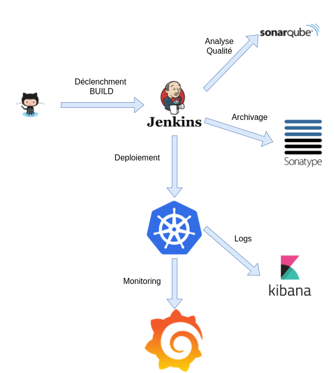

= Usine Logicielle

:toc:

Nous mettons en place l'Usine Logicielle pour industrialiser nos développements et notamment accélérer les temps de mises en prod en suivant une démarche de Continuous Delivery : tout commit sur un dépôt GIT d'une application déclenche la construction des binaires de l'application suivi du déploiement de l'application.

Pour ce faire, l'Usine Logicielle fournit des outils pour automatiser la construction des binaires ainsi que des environnements de déploiement.

== Outillage

L'Outillage mis en place permet :

* La gestion des sources des applications
* La construction des binaires de l'application et l'exécution des tests unitaires (via Jenkins)
* L'archivage des binaires (dans Nexus)
* L'analyse qualité des sources (via SonarQube)

=== Gestion des Sources

Les sources sont hébergées dans une Organisation Github https://github.com/SofteamOuest-Opus[dédiée].

Les sources d'une application sont gérées dans un dépôt GIT.

=== Jenkins

Nous utilisons https://jenkins.k8.wildwidewest.xyz[Jenkins] pour orchestrer les BUILDS.

==== Configuration Jenkins

De manière à simplifier au maximum la mise en place de l'Usine Logicielle, le serveur Jenkins est configuré automatiquement, en utilisant le plugin https://jenkins.io/projects/jcasc/[Jenkins Configuration as Code].

[source]
....
@TAG SCN_JNK_CONF
Scenario: Jenkins configured via JCASC
Given I am logged in Jenkins as a Jenkins Administrator
When I import a Jenkins Configuration File
Then the Jenkins configuration is correctly updated
....

La configuration concerne notamment :

* Les comptes utilisateurs
* Les secrets (mot de passe Nexus, token sonarqube)
* Les fichiers de configuration (Gradle, SSH)
* L'import d'organisations GitHub
* L'import de plugins (exemple : JIRA)

==== Jobs Jenkins

Nous utilisons Jenkins pour orchestrer nos BUILDS. De manière à uniformiser nos jobs Jenkins, nous les implémentons via des Jenkinsfile.

==== Job de BUILD

Le Job de BUILD d'une application permet de construire les binaires (image Docker) de l'application (en version SNAPSHOT) et déclencher un Job de Déploiement

[source]
....
@TAG SCN_JNK_JOB_BUILD REQ_JNK_JOB_BUILD REQ_NEXUS REQ_SONARQUBE
Scenario: Build Application
Given I am logged in Jenkins as a Jenkins User
When I execute an application BUILD job
Then the Job builds the application's docker image and deploys it to Nexus
And runs the quality analysis
And triggers the RUN Job
....

==== Job de RELEASE

Le Job de RELEASE permet de créer une RELEASE des sources et binaires d'une application.

[source]
....
@TAG SCN_JNK_JOB_RELEASE
Scenario: Release Application
Given I am logged in Jenkins as a Jenkins User
When I execute an application RELEASE job
Then the Job builds the application's docker image in RELEASE version and deploys it to Nexus
And the Job builds the application's jar in RELEASE version and deploys it to Nexus
....

==== Job de RELEASE des charts

Le Job de RELEASE permet de créer une RELEASE des packages Helm.

[source]
....
@TAG SCN_JNK_JOB_RELEASE_HELM
Scenario: Release Helm Package
Given I am logged in Jenkins as a Jenkins User
When I execute an application HELM RELEASE job
And select the packages to release
And specify the release version
Then the Job builds generates the chart release
And publishes it the helm repository
....

==== Job de RUN

Le Job de RUN permet de déployer une application sur le cluster.

[source]
....
@TAG SCN_JNK_JOB_RUN REQ_JNK_JOB_RUN_SEC REQ_APP_SSL
Scenario: Run Application
Given I am logged in Jenkins as a Jenkins User
When I execute an application RUN job and specify
* the application name
* the application version
* the application "helm package" version
* the target environment
Then the application is deployed
....

==== Job de FULL-RUN

Le Job de FULL-RUN permet de déployer toutes les applications.

Le Job prend les même paramètres que le Job de RUN (pour chaque application à déployer).

[source]
....
@TAG SCN_JNK_JOB_FULL_RUN REQ_JNK_JOB_FULL_RUN
Scenario: Run All Applications
Given I am logged in Jenkins as a Jenkins User
When I execute the FULL-RUN job and specify
* for each application
 - its name
 - its version
 - its "helm package" version
* the target environment
Then the applications are deployed
....

=== JIRA

Nous utilisons https://wildwidewest.atlassian.net[JIRA] pour suivre le développement du Projet.

[source]
....
@TAG SCN_APP_COMMIT
Scenario: GIT Commit Format
Given I am a developer
When I put a JIRA ticket number in a commit
Then my commit appears in the JIRA ticket
....

== Environnements

Nous déployons nos applications dans différents environnements.

* L'environnement de DEV permet de tester la dernière version SNAPSHOT des applications (=> version en cours de développement).
* L'environnement de RE7 permet de tester une version RELEASE avant Mise en Prod (=> version à qualifier).
* L'environnement de PROD correspond à l'environnement de PROD (=> version mise à dispo des utilisateurs).

[source]
....
@TAG SCN_APP_URL_HORS_PROD REQ_ENVIRONMENT_ISOLATION
Scenario: Non-Prod Application URL
Given I am logged in Jenkins as a Jenkins User
When I deploy the application myapplication in a non-Prod environment XXX
Then the application URL is https://myapplication-XXX.k8.wildwidewest.xyz
....

[source]
....
@TAG SCN_APP_URL_PROD
Scenario: Prod Application URL
Given I am logged in Jenkins as a Jenkins User
When I deploy the application myapplication in the Prod environment
Then the application URL is https://myapplication.k8.wildwidewest.xyz
....

=== Centralisation des Logs

La centralisation des Logs permet d'analyser via une IHM unique les logs de toutes les applications.

Pour simplifier la mise en place, les applications partagent un même format de Logs.

[source]
....
@TAG SCN_APP_LOGS REQ_LOG_SERVER_SECURITY REQ_APP_LOGS
Scenario: Log Tracing
Given I am a developer of an application
When my application logs a message
Then the log is traced in the Log Server
....

=== Monitoring

Le monitoring permet de monitorer l'état du système.

[source]
....
@TAG SCN_APP_MONITORING REQ_MONITORING_SECURITY
Scenario: Application Monitoring
Given I am a developer of an application
When the monitoring system detects an alert
* CPU Usage > 90 %
Then the alert is sent by email to a list of recipients
....

== Exigences

=== REQ_JNK_JOB_BUILD

The BUILD is triggered automatically after pushing an update to the GIT repository.

=== REQ_JNK_JOB_FULL_RUN

If any of the information necessary to deploy an application is not defined, the application is not deployed.

=== REQ_JNK_JOB_RUN_SEC

Secrets musts be stored in the chart and encrypted (https://github.com/mozilla/sops).

=== REQ_NXS_SECURITY

Access to Nexus Server requires authentication (login, password).

=== REQ_SNQ_SECURITY

Access to SonarQube Server requires authentication (token).

=== REQ_LOG_SERVER_SECURITY

Access to Log Server requires authentication (login, password)

=== REQ_MONITORING_SECURITY

Access to the Monitoring Server requires authentication (login, password).

=== REQ_NEXUS

Jars and Docker images are stored in https://Nexus.k8.wildwidewest.xyz/[Nexus].

=== REQ_SONARQUBE

Quality Analysis is achieved using https://sonarqube.k8.wildwidewest.xyz/[SonarQube].

=== REQ_APP_LOGS

Logs must respect the following format :

* LEVEL: Log Level (DEBUG, INFO, ERROR)
* MESSAGE
* APPLICATION_NAME : Application Name
* APPLICATION_NAME : Environnement Name
* CORRELATION_ID : Message Correlation ID
* STACKTRACE : StackTrace if the message is an exception

=== REQ_APP_SSL

Application must be accessible only via HTTPS.

=== REQ_ENVIRONMENT_ISOLATION

Kubernetes Environments must be isolated. A Kubernete Service can not call the services of other environments.